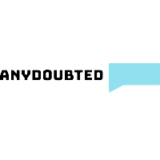
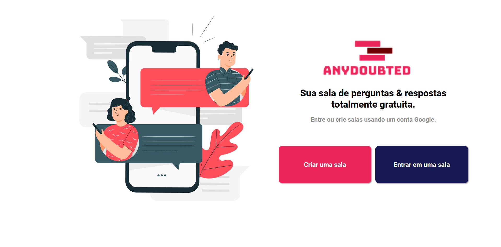

<p aling="center">
    
</p>

## AnyDoubted
<div aling="center">
    
</div>

## Sobre

<div>
    <h3>Acesse o site nesse link <a>https://anydoubted.firebaseapp.com/</a></h3>
    <p>Esse é um projeto com um intuito de construir um sistemas de sala de conversar online.</p>
</div>

## Ajustes e melhorias
O projeto está ainda em fase de desenvolvimento e as próximas atualizações serão voltadas para as seguintes tarefas:
- [] Colocar outras formas de login.
- [] Adicionar Like nas mensagens.
- [] Mais funções ao Admin da sala.
- [] Admin pode iniciar votações.


## Tecnologias :computer:

- [React](https://reactjs.org/)
- [Firebase](https://firebase.google.com/)
- [Typescript](https://www.typescriptlang.org/)

## Como iniciar o projeto :rocket:
Clone o projeto e entre na pasta dele.

```bash
$ git clone https://github.com/Gabriel-Aparecido03/AnyDoubted.git
$ cd letmeask
```

Siga as intruções abaixo:
```bash
# Install the dependencies
$ yarn
# Start the project
$ yarn start
```
The app will be available for access on your browser at http://localhost:3000